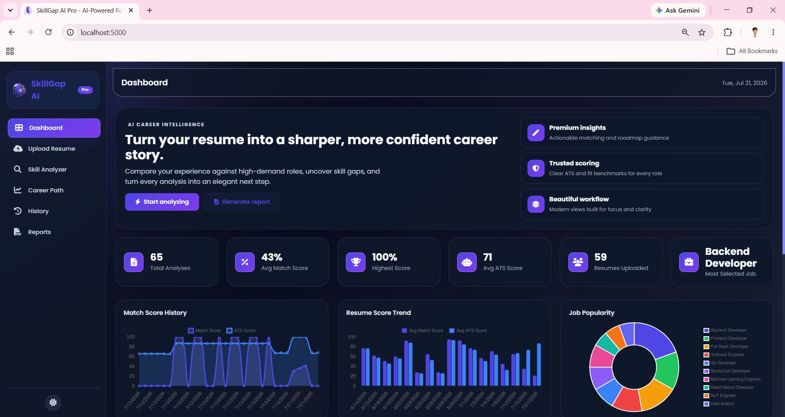
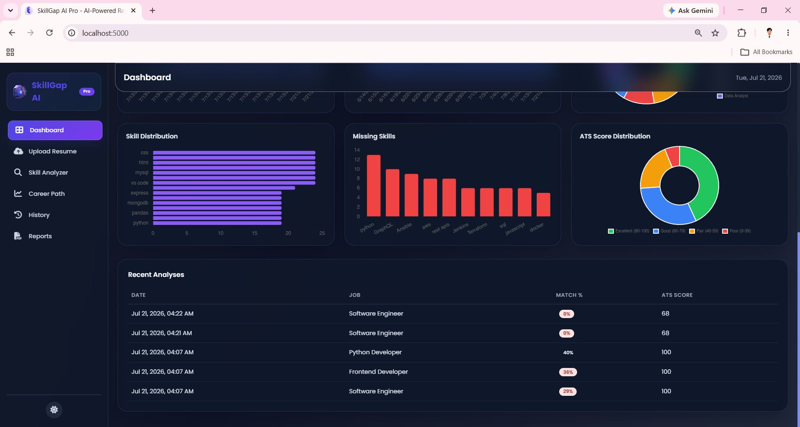
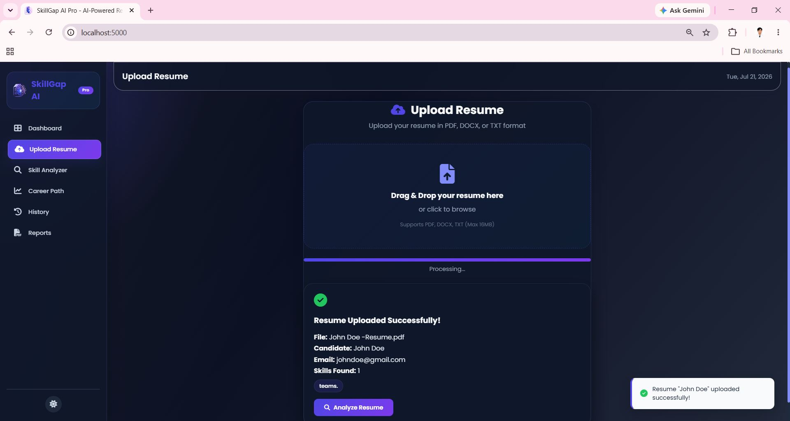
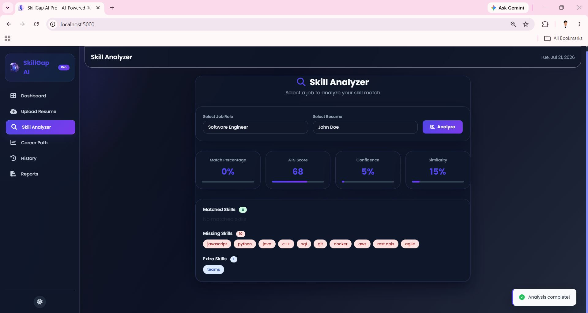
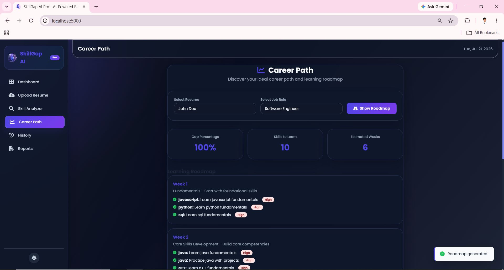
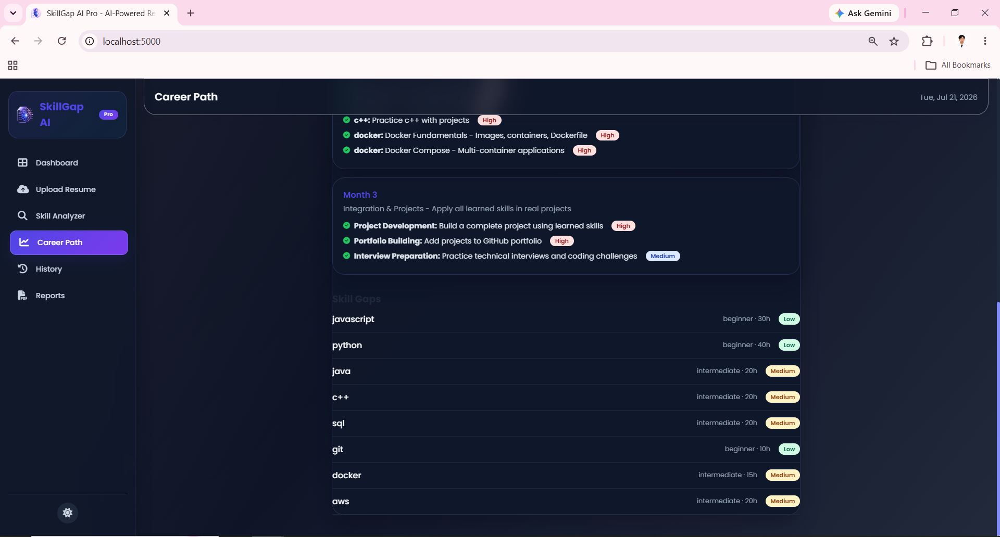
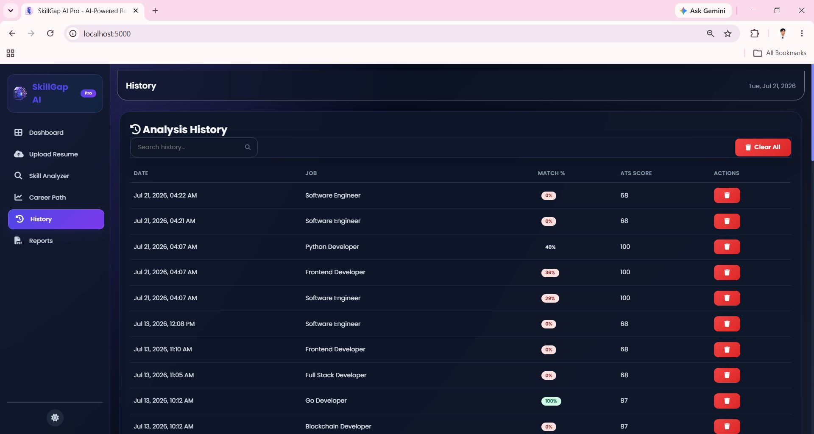
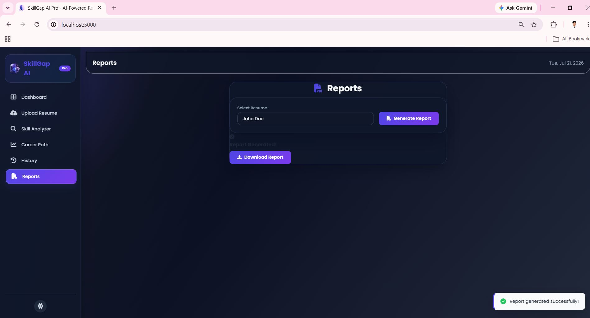
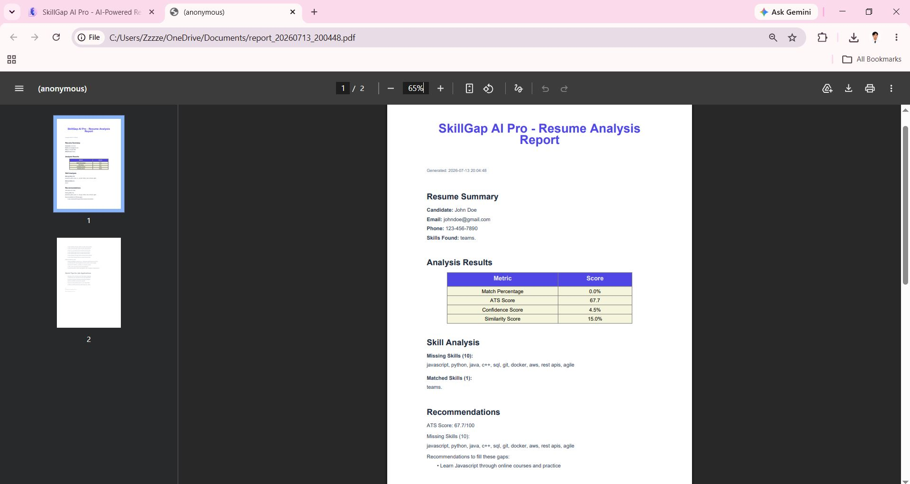
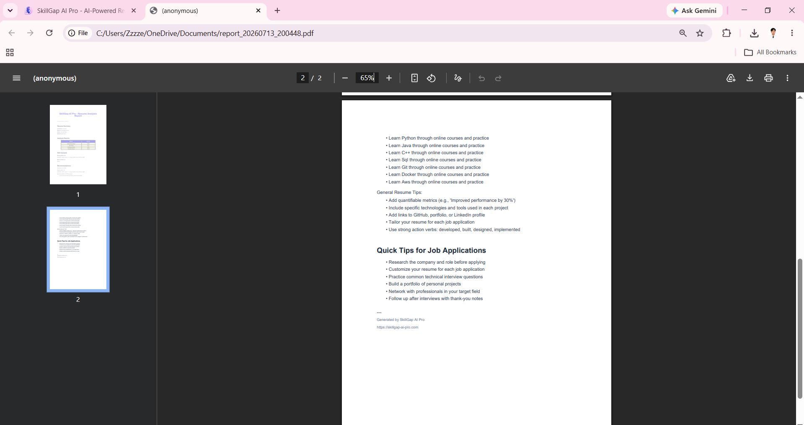

# SkillGap AI Pro

## Description
SkillGap AI Pro is a Flask-based web application that helps job seekers evaluate their resumes, identify skill gaps, and improve their chances of landing target roles. The platform combines resume parsing, ATS scoring, job matching, recommendations, and report generation in a simple dashboard.

## Features
- Upload and parse resumes in PDF or DOCX format
- Analyze resume alignment with job descriptions
- Generate ATS compatibility scores and keyword insights
- Recommend missing skills and career growth actions
- Create downloadable reports and career roadmaps
- Track analysis history

## Screenshots













## 5. Tech Stack

### Frontend
- HTML5, CSS3, and Vanilla JavaScript
- Chart.js for data visualizations
- Font Awesome and Google Fonts (Poppins)


### Backend
- Python 3.13 and Flask 2.3.3
- Flask-SQLAlchemy 3.1.1 for ORM
- Flask-CORS and python-dotenv

### Machine Learning
- Pandas and NumPy for data processing
- Scikit-learn for TF-IDF and cosine similarity
- Regex for skill extraction

### Database
- SQLite for development and MySQL for production
- SQLAlchemy 2.0.21

### Resume Parsing
- pdfplumber, python-docx, and python-magic-bin

### Reports
- ReportLab 4.0.7 for PDF generation

## Installation
1. Clone the repository
2. Create and activate a virtual environment
   ```bash
   python -m venv .venv
   .venv\Scripts\activate
   ```
3. Install dependencies
   ```bash
   pip install -r requirements.txt
   ```
4. Run the application
   ```bash
   python app.py
   ```

## Usage
1. Open the app in your browser at http://localhost:5000
2. Upload your resume
3. Select or enter a target job title
4. Review the match score, ATS score, and skill recommendations
5. Generate and download your report
